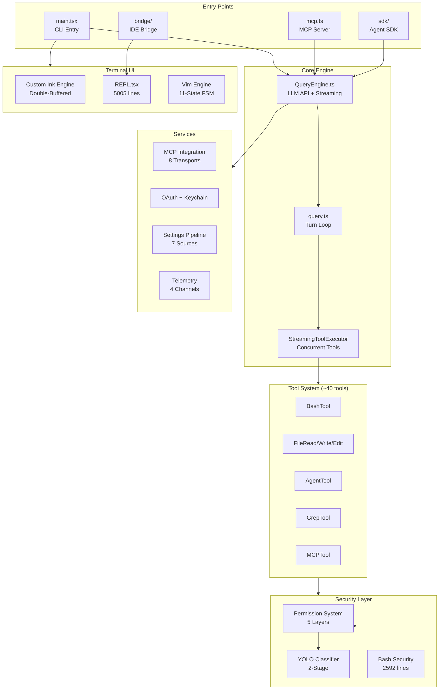

# Claude Code Deep Research

### The Most Comprehensive Source-Level Analysis of Claude Code's Architecture

**1,900 TypeScript files | 205,000+ lines of code | 14 subsystems | 100+ file:line references**

[English](README.md) | [中文](README.zh-CN.md)

---

## What Is This?

This repository contains a **deep, source-level research analysis** of [Claude Code](https://claude.ai/code) — Anthropic's official CLI tool for AI-assisted software engineering. The analysis is based on a source map leak from March 31, 2026, covering ~1,900 TypeScript files and ~205K+ lines of code.

Unlike surface-level overviews, every finding in this repository is backed by **specific file paths and line numbers** from the source code.

## System Architecture

## Documentation

### Architecture (System-Level)

| # | Chapter | Description |
|---|---------|-------------|
| 00 | [System Overview](docs/architecture/00-overview.md) | Full system map, tech stack, scale metrics |
| 01 | [Entry Points & Startup](docs/architecture/01-entry-points.md) | CLI, MCP, SDK, Bridge entry points + parallel prefetch |
| 02 | [Query Engine](docs/architecture/02-query-engine.md) | Two-layer AsyncGenerator, streaming, retry logic |
| 03 | [State Management](docs/architecture/03-state-management.md) | Zustand store, selectors, change tracking |

### Deep Dives (Subsystem Analysis)

| # | Chapter | Key Files | Description |
|---|---------|-----------|-------------|
| 01 | [Plugin System](docs/deep-dives/plugin-system.md) | 10+ files, 6K+ LOC | Marketplace, 3-phase loading, anti-impersonation |
| 02 | [Hook System](docs/deep-dives/hook-system.md) | 7 files | 27 event types, 4 execution modes, trust checks |
| 03 | [Tool System](docs/deep-dives/tool-system.md) | `Tool.ts` + 40 dirs | `buildTool()` factory, Zod schemas, permission hooks |
| 04 | [Multi-Agent](docs/deep-dives/multi-agent.md) | coordinator/ | 4-phase pipeline, fork cache, team swarm |
| 05 | [MCP Integration](docs/deep-dives/mcp-integration.md) | services/mcp/ | 8 transports, 7-scope config, OAuth + XAA |
| 06 | [Skill System](docs/deep-dives/skill-system.md) | skills/ | 5-source loading, conditional activation |
| 07 | [Session Persistence](docs/deep-dives/session-persistence.md) | sessionStorage.ts | JSONL append log, parentUuid chains, 64KB recovery |
| 08 | [Bridge & IDE](docs/deep-dives/bridge-ide.md) | bridge/ | V1/V2/Env-less protocols, JWT refresh, echo dedup |
| 09 | [OAuth & Credentials](docs/deep-dives/oauth-credentials.md) | oauth/ + auth.ts | PKCE flow, triple-check refresh, keychain |
| 10 | [Settings Pipeline](docs/deep-dives/settings-pipeline.md) | settings/ | 7-source merge, MDM, GrowthBook |
| 11 | [UI Rendering](docs/deep-dives/ui-rendering.md) | ink/ + components/ | Custom Ink, double-buffer, React Compiler |
| 12 | [Vim Engine](docs/deep-dives/vim-engine.md) | vim/ | 11-state FSM, text objects, dot-repeat |

### Security Analysis

| # | Chapter | Description |
|---|---------|-------------|
| 01 | [YOLO Classifier](docs/security/yolo-classifier.md) | Two-stage Fast/Thinking classifier, fail-closed design |
| 02 | [Permission System](docs/security/permission-system.md) | 5-layer permission gating architecture |
| 03 | [Bash Security](docs/security/bash-security.md) | 2,592-line security validator |
| 04 | [Prompt Injection Defenses](docs/security/prompt-injection-defenses.md) | Transcript sanitization, tool_use-only policy |

### Internal Mechanisms (Exclusive Findings)

| # | Chapter | Description |
|---|---------|-------------|
| 01 | [Undercover Mode](docs/internals/undercover-mode.md) | Auto-hide AI attribution for Anthropic employees |
| 02 | [Penguin Mode (Fast Mode)](docs/internals/penguin-fast-mode.md) | Internal codename, API endpoint, org-level control |
| 03 | [Attribution System](docs/internals/attribution-system.md) | Enhanced PR attribution with N-shot counting |
| 04 | [Internal Repo Allowlist](docs/internals/internal-repo-allowlist.md) | ~30 Anthropic private repositories |
| 05 | [Model Codenames](docs/internals/model-codenames.md) | Capybara, Tengu, Fennec, Numbat mappings |
| 06 | [Feature Flag Obfuscation](docs/internals/feature-flag-obfuscation.md) | `tengu_<word1>_<word2>` naming pattern |
| 07 | [Telemetry & Privacy](docs/internals/telemetry-privacy.md) | 4-channel architecture, PII protection |

### Career Guide

| # | Chapter | Description |
|---|---------|-------------|
| 01 | [AI Agent Engineer Interview Guide](career/ai-agent-interview-guide.md) | 6 technical pillars, tiered interview questions, drill-down chains, 30-day action plan |

### Diagrams

| Diagram | Description |
|---------|-------------|
| [System Overview](docs/diagrams/system-overview.mmd) | Full architecture map |
| [Query Flow](docs/diagrams/query-flow.mmd) | Request lifecycle |
| [Permission Flow](docs/diagrams/permission-flow.mmd) | Security decision tree |
| [Multi-Agent](docs/diagrams/multi-agent.mmd) | Coordinator & fork model |

## Key Numbers

| Metric | Value |
|--------|-------|
| Total Source Files | ~1,900 TypeScript files |
| Lines of Code | ~205,000+ |
| Tool Implementations | ~40 tools |
| Slash Commands | ~100 commands |
| Hook Event Types | 27 |
| Settings Sources | 7 layers |
| MCP Transports | 8 types |
| Security Layers | 5 |
| Telemetry Channels | 4 |
| Chapters in This Repo | 28 |

## How This Differs from Other Analyses

| Dimension | Others | This Repo |
|-----------|--------|-----------|
| Source References | Chapter-level overview | **`file:line` precision** (100+ refs) |
| Security Analysis | Surface-level | **YOLO 2-stage classifier full teardown** |
| Internal Codenames | Partial mentions | **Tengu/Penguin/Capybara/Fennec/Numbat complete map** |
| Exclusive Content | None | **Undercover Mode, internal repo list, 4096-byte stdin modeling** |
| Production Incidents | None | **#23192, #24099, #30337, INC-3028, inc-3930** |
| Implementation Detail | Architecture descriptions | **Exit code protocols, triple-check patterns, generation counters** |

## Tech Stack

- **Language**: TypeScript (strict mode)
- **Runtime**: Bun
- **Terminal UI**: React + Ink (deeply customized)
- **CLI Parsing**: Commander.js
- **Schema Validation**: Zod v4
- **State Management**: Zustand
- **Telemetry**: OpenTelemetry + Datadog + Perfetto

## Disclaimer

This repository contains **analysis and research documentation only**. It does not contain or redistribute the original Claude Code source code. The source code analyzed is the property of Anthropic, PBC. This project is maintained for educational and security research purposes.

## License

[MIT](LICENSE) - Analysis and documentation only.
