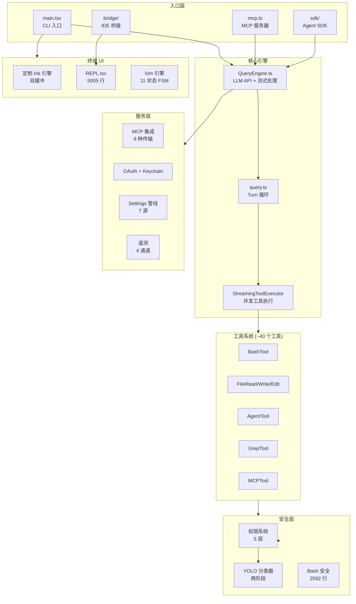

# Claude Code 深度源码研究

### 最全面的 Claude Code 架构源码级分析

**1,900 个 TypeScript 文件 | 205,000+ 行代码 | 14 个子系统 | 100+ 处 file:line 精确引用**

[English](README.md) | [中文](README.zh-CN.md)

---

## 这是什么？

本仓库包含对 [Claude Code](https://claude.ai/code)（Anthropic 官方 AI 辅助编程 CLI 工具）的**深度源码级研究分析**。分析基于 2026 年 3 月 31 日的 source map 泄露，覆盖约 1,900 个 TypeScript 文件和 205K+ 行代码。

与表面概述不同，本仓库的每一个发现都有**具体的文件路径和行号**支撑。

## 系统架构

## 文档目录

### 架构分析（系统层级）

| # | 章节 | 描述 |
|---|------|------|
| 00 | [系统全景](docs/architecture/zh-CN/00-overview.md) | 完整系统图谱、技术栈、规模指标 |
| 01 | [入口与启动](docs/architecture/zh-CN/01-entry-points.md) | CLI、MCP、SDK、Bridge 入口 + 并行预取 |
| 02 | [查询引擎](docs/architecture/zh-CN/02-query-engine.md) | 双层 AsyncGenerator、流式处理、重试逻辑 |
| 03 | [状态管理](docs/architecture/zh-CN/03-state-management.md) | Zustand store、选择器、变更追踪 |

### 深度分析（子系统级别）

| # | 章节 | 关键文件 | 描述 |
|---|------|---------|------|
| 01 | [Plugin 系统](docs/deep-dives/zh-CN/plugin-system.md) | 10+ 文件, 6K+ 行 | Marketplace 三阶段加载、反冒充 |
| 02 | [Hook 系统](docs/deep-dives/zh-CN/hook-system.md) | 7 文件 | 27 种事件、4 种执行模式、信任检查 |
| 03 | [工具系统](docs/deep-dives/zh-CN/tool-system.md) | `Tool.ts` + 40 目录 | `buildTool()` 工厂、Zod schemas |
| 04 | [多 Agent](docs/deep-dives/zh-CN/multi-agent.md) | coordinator/ | 4 阶段管线、fork 缓存、团队 swarm |
| 05 | [MCP 集成](docs/deep-dives/zh-CN/mcp-integration.md) | services/mcp/ | 8 种传输、7 级配置、OAuth + XAA |
| 06 | [Skill 系统](docs/deep-dives/zh-CN/skill-system.md) | skills/ | 5 源加载、条件激活 |
| 07 | [会话持久化](docs/deep-dives/zh-CN/session-persistence.md) | sessionStorage.ts | JSONL 追加日志、parentUuid 链 |
| 08 | [Bridge & IDE](docs/deep-dives/zh-CN/bridge-ide.md) | bridge/ | V1/V2/Env-less 协议、JWT 刷新 |
| 09 | [OAuth & 凭证](docs/deep-dives/zh-CN/oauth-credentials.md) | oauth/ + auth.ts | PKCE 流程、三重检查刷新 |
| 10 | [Settings 管线](docs/deep-dives/zh-CN/settings-pipeline.md) | settings/ | 7 源合并、MDM、GrowthBook |
| 11 | [UI 渲染](docs/deep-dives/zh-CN/ui-rendering.md) | ink/ + components/ | 定制 Ink、双缓冲、React Compiler |
| 12 | [Vim 引擎](docs/deep-dives/zh-CN/vim-engine.md) | vim/ | 11 状态 FSM、文本对象、点重复 |

### 安全分析

| # | 章节 | 描述 |
|---|------|------|
| 01 | [YOLO 分类器](docs/security/zh-CN/yolo-classifier.md) | 两阶段 Fast/Thinking 分类器、fail-closed 设计 |
| 02 | [权限系统](docs/security/zh-CN/permission-system.md) | 5 层权限门控架构 |
| 03 | [Bash 安全](docs/security/zh-CN/bash-security.md) | 2,592 行安全验证器 |
| 04 | [Prompt 注入防御](docs/security/zh-CN/prompt-injection-defenses.md) | Transcript 净化、tool_use-only 策略 |

### 内部机制（独家发现）

| # | 章节 | 描述 |
|---|------|------|
| 01 | [Undercover 模式](docs/internals/zh-CN/undercover-mode.md) | Anthropic 员工自动隐藏 AI 归因 |
| 02 | [Penguin 模式 (Fast Mode)](docs/internals/zh-CN/penguin-fast-mode.md) | 内部代号、API 端点、组织级控制 |
| 03 | [Attribution 系统](docs/internals/zh-CN/attribution-system.md) | 增强 PR 归因与 N-shot 计数 |
| 04 | [内部仓库白名单](docs/internals/zh-CN/internal-repo-allowlist.md) | ~30 个 Anthropic 私有仓库 |
| 05 | [模型代号](docs/internals/zh-CN/model-codenames.md) | Capybara/Tengu/Fennec/Numbat 映射 |
| 06 | [Feature Flag 混淆](docs/internals/zh-CN/feature-flag-obfuscation.md) | `tengu_<word1>_<word2>` 命名模式 |
| 07 | [遥测与隐私](docs/internals/zh-CN/telemetry-privacy.md) | 四通道架构、PII 保护 |

## 关键数字

| 指标 | 值 |
|------|-----|
| 总源文件数 | ~1,900 个 TypeScript 文件 |
| 代码行数 | ~205,000+ |
| 工具实现 | ~40 个 |
| Slash 命令 | ~100 个 |
| Hook 事件类型 | 27 种 |
| Settings 源 | 7 层 |
| MCP 传输 | 8 种 |
| 安全层 | 5 层 |
| 遥测通道 | 4 个 |
| 本仓库章节 | 27 章 |

## 与其他分析的差异

| 维度 | 其他项目 | 本仓库 |
|------|---------|--------|
| 源码引用 | 章节级概述 | **`file:line` 精确定位** (100+ 处) |
| 安全分析 | 表面层 | **YOLO 两阶段分类器完整拆解** |
| 内部代号 | 部分提及 | **Tengu/Penguin/Capybara/Fennec/Numbat 完整映射** |
| 独家内容 | 无 | **Undercover Mode、内部仓库白名单、4096字节 stdin 建模** |
| 生产事故 | 无 | **#23192, #24099, #30337, INC-3028, inc-3930** |
| 实现细节 | 架构描述 | **Exit code 协议、Triple-check、generation counter** |

## 免责声明

本仓库仅包含**分析和研究文档**。不包含也不分发 Claude Code 原始源代码。所分析的源代码是 Anthropic, PBC 的财产。本项目仅用于教育和安全研究目的。

## 许可证

[MIT](LICENSE) — 仅限分析和文档。
