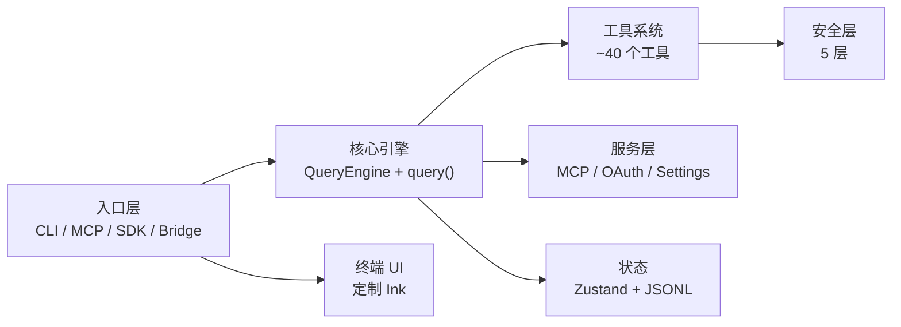

# 系统全景

## 规模

| 指标 | 值 |
|------|-----|
| TypeScript 源文件 | ~1,900 |
| 代码行数 | ~205,000+ |
| 工具实现 | ~40 个 |
| Slash 命令 | ~100 个 |
| 运行时 | Bun |
| 终端 UI | React + Ink（深度定制） |
| CLI 解析 | Commander.js (extra-typings) |
| Schema 校验 | Zod v4 |
| 状态管理 | Zustand |

## 高层架构

## 各层职责

### 入口层
- `src/main.tsx` — CLI 启动：Commander.js 解析、Ink 渲染器初始化、并行预取（MDM、Keychain、API 预连接）
- `src/entrypoints/cli.tsx` — Leader/Coordinator 编排
- `src/entrypoints/mcp.ts` — MCP 服务器模式
- `src/entrypoints/sdk/` — Agent SDK 集成

### 核心引擎
- `src/QueryEngine.ts` — 会话级 AsyncGenerator：流式处理、工具调用循环、思考模式、重试逻辑、token 计数
- `src/query.ts` — 轮次级查询循环：预算执行、中止处理
- `src/services/tools/StreamingToolExecutor.ts` — 并发工具执行，读写锁语义

### 工具系统
- `src/Tool.ts` — `buildTool()` 4 行工厂函数，从 Zod schema 创建工具对象
- `src/tools/` — ~40 个工具子目录，每个包含实现、UI 和 prompt 文件

### 安全层
五层，按顺序评估：
1. 权限规则（settings 中的 allow/deny/ask）
2. 模式校验（default/plan/auto/bypass）
3. 工具级检查（per-tool `isAllowed`）
4. 路径安全（CWD 约束）
5. OS 沙箱（macOS Seatbelt / Linux 命名空间）

### 服务层
- MCP — 8 种传输类型，7 级配置，企业排他性
- OAuth — PKCE 流程 + Keychain 存储 + 三重检查刷新
- Settings — 7 源合并管线，MDM + GrowthBook
- Analytics — 4 通道遥测（Datadog、1P、BigQuery、OTel Traces）
- Compact — 上下文窗口压缩

### 状态层
- `src/state/AppState.tsx` — Zustand store（~1,200 行）
- `src/utils/sessionStorage.ts` — JSONL 追加式日志，parentUuid 链

### 终端 UI
- 定制 Ink 分支 — 双缓冲渲染、cell 级差异化
- `src/screens/REPL.tsx` — 5,005 行主屏幕
- 虚拟滚动、文本选择、搜索高亮
- 完整 Vim 编辑（11 状态 FSM）
- StreamingMarkdown 增量 tokenization

## 关键设计模式

- **Feature flags via `bun:bundle`**：`feature('FLAG_NAME')` 门控实现编译期死代码消除。重要 flag：`PROACTIVE`、`KAIROS`、`BRIDGE_MODE`、`DAEMON`、`VOICE_MODE`、`COORDINATOR_MODE`
- **ANT_ONLY 门控**：`process.env.USER_TYPE === 'ant'` 用于内部功能
- **懒加载**：重型模块（OpenTelemetry、gRPC、analytics）通过动态 `import()` 延迟加载
- **并行预取**：MDM、Keychain、API 预连接在重型模块评估前运行
- **Memoization**：广泛使用 `lodash.memoize()` + `.cache.clear?.()` 失效
- **导入循环避免**：权限和工具进度类型集中在 `src/types/`
