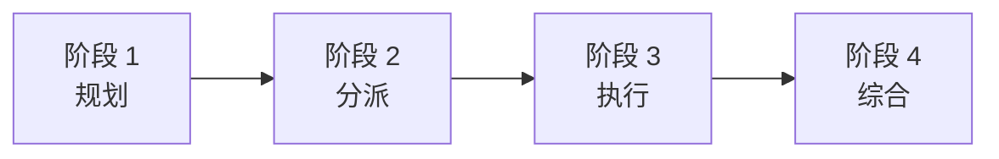

# 多 Agent 系统

## 概述

Claude Code 的多 Agent 系统由两种互补机制组成：
1. **Coordinator 模式** -- 用于任务分解与编排的 4 阶段流水线
2. **Team/Swarm** -- 通过 TeamCreateTool 生成使用不同后端的并行 Agent

## Coordinator 模式（`src/coordinator/coordinatorMode.ts`）

### 4 阶段流水线



**阶段 1 -- 规划**：将用户请求分解为带依赖图的离散任务
**阶段 2 -- 分派**：将任务路由到合适的 Agent 类型
**阶段 3 -- 执行**：监控 Agent 进度，处理失败情况
**阶段 4 -- 综合**：将各结果合并为连贯的响应

### 7 种任务类型
`code`、`research`、`test`、`debug`、`review`、`refactor`、`deploy`

## Fork 缓存共享（`src/tools/AgentTool/forkSubagent.ts`）

Fork 模型为子 Agent 实现了 **LLM Copy-on-Write**：

```
父 Agent（系统提示词 + 对话历史）
    │
    ├── fork() ──→ 子 Agent 1（共享父 Agent 的 LLM 缓存前缀）
    ├── fork() ──→ 子 Agent 2（共享父 Agent 的 LLM 缓存前缀）
    └── fork() ──→ 子 Agent 3（共享父 Agent 的 LLM 缓存前缀）
```

子 Agent 继承父 Agent 的系统提示词和对话历史作为缓存前缀。每个子 Agent 的新消息追加在其上，实现了 LLM KV Cache 的 Copy-on-Write 语义。这意味着 N 个子 Agent 不需要 N 份系统提示词的副本 -- 它们共享同一个缓存前缀。

## Team/Swarm（TeamCreateTool）

### 三种后端

| 后端 | 平台 | 机制 |
|------|------|------|
| `tmux` | 默认 | Terminal Multiplexer 会话 |
| `iTerm2` | macOS | 原生 iTerm2 标签页 |
| `in-process` | 兜底方案 | Worker Thread |

### 生成流程
1. TeamCreateTool 创建新的 Agent 实例
2. Agent 接收任务描述 + 工作区上下文
3. Agent 独立运行，拥有自己的 Tool 权限
4. 结果由 Coordinator 收集

注意：TeamCreateTool 位于 `SAFE_YOLO_ALLOWLISTED_TOOLS` 中，因为"队友拥有各自的权限检查"。

## AbortController 级联

三层中止层级：

```
Session AbortController
  └── Sibling AbortController（Agent 内的每轮对话）
        └── Per-Tool AbortController（每次 Tool 调用）
```

- Session 中止 → 取消所有 Agent 的全部轮次和 Tool
- Sibling 中止 → 取消当前轮次但保留会话
- Per-tool 中止 → 仅取消单个 Tool 的执行
- 对 Per-tool Controller 使用 `WeakRef` 确保 GC 安全，防止 Tool 完成后的内存泄漏

## Agent 间通信

Agent 之间通过以下方式通信：
1. **共享文件系统** -- 同一工作区，文件级别的协调
2. **消息传递** -- Coordinator 从各 Agent 收集结果
3. **任务状态** -- TeammateIdle Hook 在 Agent 完成时发出通知
