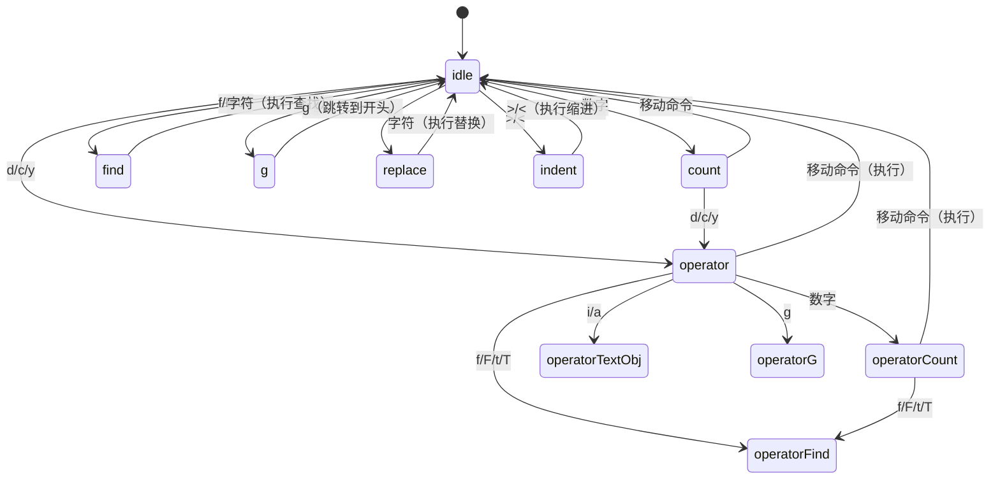

# Vim 引擎

## 概述

Claude Code 内置了一个完整的 Vim 编辑引擎，用于终端文本输入。它采用双层有限状态机，支持 INSERT/NORMAL 模式、文本对象、操作符、移动命令、dot-repeat 以及 yank 寄存器。

## 文件清单

| 文件路径 | 行数 | 职责 |
|-----------|-------|---------------|
| `src/vim/types.ts` | 199 | 状态机类型定义 |
| `src/vim/transitions.ts` | 490 | 状态转换表 |
| `src/vim/operators.ts` | 556 | delete/change/yank + 文本对象 |
| `src/vim/motions.ts` | 82 | 移动命令解析 |
| `src/vim/textObjects.ts` | 186 | word/WORD/引号/括号对象 |
| `src/components/VimTextInput.tsx` | 200 | Vim 模式文本输入组件 |

## 双层状态机

### 外层：VimState

区分 INSERT 和 NORMAL 模式。

### 内层：CommandState（11 种状态）

```
idle → count → operator → operatorCount → operatorFind →
operatorTextObj → find → g → operatorG → replace → indent
```



## 支持的操作

### 操作符
- `d` — 删除
- `c` — 修改（删除并进入 INSERT 模式）
- `y` — 复制（yank）

### 移动命令
- `h/l` — 左/右移动
- `w/W` — 按 word/WORD 前进
- `b/B` — 按 word/WORD 后退
- `e/E` — 移至 word/WORD 末尾
- `0/$` — 行首/行尾
- `^` — 首个非空字符
- `f/F/t/T` — 查找字符

### 文本对象
- `iw/aw` — 内部/周围 word
- `iW/aW` — 内部/周围 WORD
- `i"/a"` — 内部/周围双引号
- `i'/a'` — 内部/周围单引号
- `i(/a(` — 内部/周围圆括号
- `i[/a[` — 内部/周围方括号
- `i{/a{` — 内部/周围花括号

### 特殊操作
- `.` — dot-repeat（以 `RecordedChange` 形式存储）
- `;/,` — 重复/反向查找
- `u` — 撤销
- 计数前缀（例如 `3dw` = 删除 3 个单词）

## 安全限制

`MAX_VIM_COUNT` 上限为 10,000，防止意外触发大规模操作（例如 `99999dd`）。

## 集成方式

`VimTextInput.tsx` 将状态机封装为 React/Ink 组件：
- UI 中显示模式指示器（INSERT/NORMAL）
- 不同模式下光标样式切换
- 键盘事件通过转换表分发
- yank 寄存器在整个会话中共享
