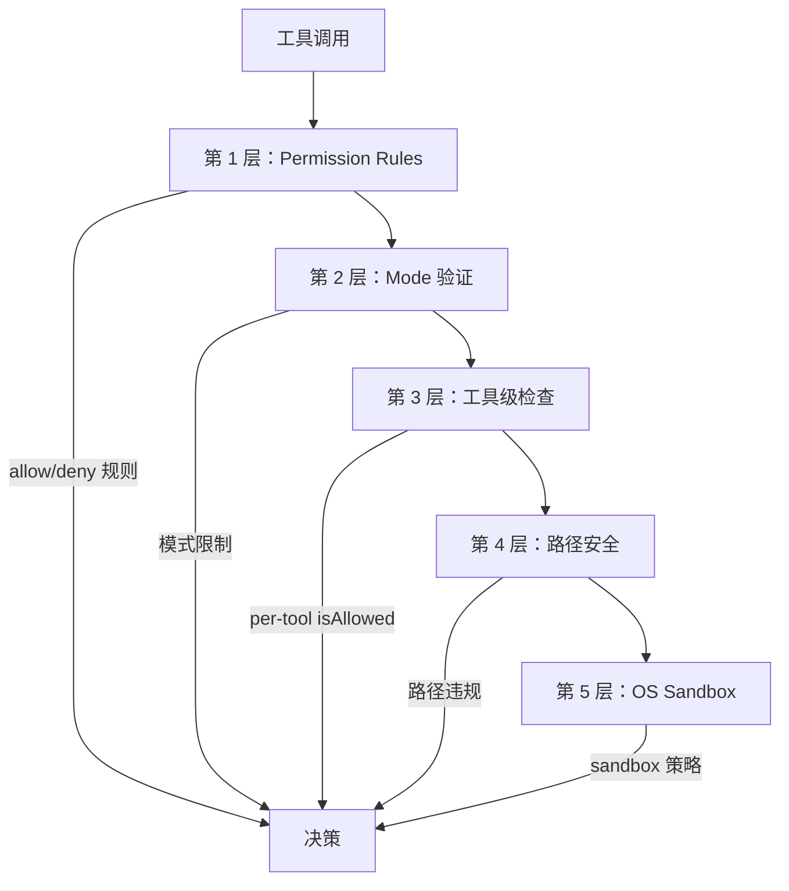

# Permission System -- 五层架构

## 概述

Claude Code 中的每一次工具调用都需要经过五层安全架构的权限检查。各层按顺序评估，第一个产生明确决策（allow/deny）的层级即为最终结果。

## 五个层级



### 第 1 层：Permission Rules

来自设置（user、project、local、managed、policy）的规则：

```json
{
  "permissions": {
    "allow": ["Bash(npm test)", "FileRead"],
    "deny": ["Bash(rm -rf *)"],
    "ask": ["Bash"]
  }
}
```

模式匹配：`ToolName(ruleContent)`，其中 ruleContent 与工具输入进行匹配。

### 第 2 层：Mode 验证

| 模式 | 行为 |
|------|------|
| `default` | 对未匹配的工具提示用户确认 |
| `plan` | 仅允许只读工具 |
| `auto` | 由 YOLO classifier 决定 |
| `bypassPermissions` | 使用提升信任级别的 YOLO classifier |
| `acceptEdits` | CWD 内的文件编辑自动允许 |

### 第 3 层：工具级检查

每个工具可以定义 `isAllowed(input, context)`：
- BashTool：经过 `bashSecurity.ts`（2,592 行）的安全校验
- FileWriteTool：CWD 目录包含性检查
- AgentTool：子 agent 权限继承

### 第 4 层：路径安全

文件操作需要通过 CWD 包含性检查：
- 项目目录内的操作：允许（前提是其他层级也通过）
- 项目目录外的操作：需要显式权限或分类器批准
- 符号链接解析防止通过 symlink 逃逸

### 第 5 层：OS Sandbox

平台特定的沙箱机制：
- **macOS**：Seatbelt profiles 限制文件和网络访问
- **Linux**：基于 Namespace 的隔离

## 权限来源

规则来自多个来源，按优先级排列：

```
policySettings（最高 -- 企业 MDM）
  → user settings (~/.claude/settings.json)
    → project settings (.claude/settings.json)
      → local settings (.claude/settings.local.json)
        → CLI args (--permission-mode)
          → session（运行时授权）
```

## Hook 集成

- `PreToolUse` hook 可以返回 `permissionDecision: allow|deny|ask`
- `PermissionRequest` hook 可以提供 `updatedInput`（修改工具输入）和 `updatedPermissions`（写入新规则）
- 详见 [Hook System](../deep-dives/hook-system.md)

## 权限决策流程

完整的决策树（包括 YOLO classifier 集成）请参阅 [Permission Flow Diagram](../diagrams/permission-flow.mmd)。
