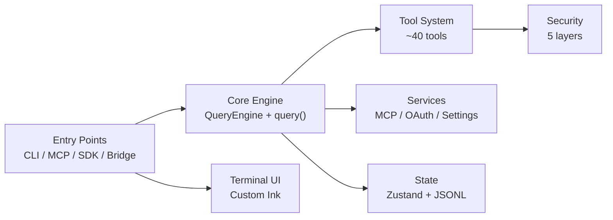

# System Overview

## Scale

| Metric | Value |
|--------|-------|
| TypeScript source files | ~1,900 |
| Lines of code | ~205,000+ |
| Tool implementations | ~40 |
| Slash commands | ~100 |
| Runtime | Bun |
| Terminal UI | React + Ink (custom fork) |
| CLI parsing | Commander.js (extra-typings) |
| Schema validation | Zod v4 |
| State management | Zustand |

## High-Level Architecture

## Layer Responsibilities

### Entry Layer
- `src/main.tsx` — CLI bootstrap, Commander.js parser, Ink renderer init, parallel prefetch (MDM, keychain, API preconnect)
- `src/entrypoints/cli.tsx` — Leader/coordinator orchestration
- `src/entrypoints/mcp.ts` — MCP server mode
- `src/entrypoints/sdk/` — Agent SDK integration

### Core Engine
- `src/QueryEngine.ts` — Session-scoped AsyncGenerator: streaming, tool-call loops, thinking mode, retry logic, token counting
- `src/query.ts` — Turn-scoped query loop: budget enforcement, abort handling
- `src/services/tools/StreamingToolExecutor.ts` — Concurrent tool execution with read-write lock semantics

### Tool System
- `src/Tool.ts` — `buildTool()` 4-line factory creating tool objects from Zod schemas
- `src/tools/` — ~40 tool subdirectories, each with implementation, UI, and prompt files

### Security Layer
Five layers, evaluated in order:
1. Permission Rules (allow/deny/ask from settings)
2. Mode Validation (default/plan/auto/bypass)
3. Tool-level Checks (per-tool `isAllowed`)
4. Path Safety (CWD containment)
5. OS Sandbox (macOS Seatbelt / Linux namespaces)

### Services
- MCP — 8 transport types, 7-scope config with enterprise exclusivity
- OAuth — PKCE flow + Keychain storage + triple-check refresh
- Settings — 7-source merge pipeline with MDM + GrowthBook
- Analytics — 4-channel telemetry (Datadog, 1P, BigQuery, OTel Traces)
- Compact — Context window compression

### State
- `src/state/AppState.tsx` — Zustand store (~1,200 LOC)
- `src/utils/sessionStorage.ts` — JSONL append-only log with parentUuid chains

### Terminal UI
- Custom Ink fork — double-buffered rendering, cell-level diffing
- `src/screens/REPL.tsx` — 5,005-line main screen
- Virtual scrolling, text selection, search overlay
- Full Vim editing (11-state FSM)
- StreamingMarkdown with incremental tokenization

## Key Design Patterns

- **Feature flags via `bun:bundle`**: `feature('FLAG_NAME')` gates dead-code-eliminate subsystems. Notable: `PROACTIVE`, `KAIROS`, `BRIDGE_MODE`, `DAEMON`, `VOICE_MODE`, `COORDINATOR_MODE`
- **ANT_ONLY gating**: `process.env.USER_TYPE === 'ant'` for internal features
- **Lazy loading**: Heavy modules (OpenTelemetry, gRPC, analytics) deferred via dynamic `import()`
- **Parallel prefetch**: MDM, keychain, API preconnect run before heavy module evaluation
- **Memoization**: Extensive `lodash.memoize()` with `.cache.clear?.()` invalidation
- **Import cycle avoidance**: Permission and tool progress types centralized in `src/types/`
