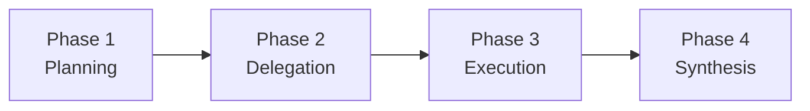

# Multi-Agent System

## Overview

Claude Code's multi-agent system consists of two complementary mechanisms:
1. **Coordinator Mode** — A 4-phase pipeline for task decomposition and orchestration
2. **Team/Swarm** — TeamCreateTool for spawning parallel agents with different backends

## Coordinator Mode (`src/coordinator/coordinatorMode.ts`)

### 4-Phase Pipeline



**Phase 1 — Planning**: Decompose user request into discrete tasks with dependency graph
**Phase 2 — Delegation**: Route tasks to appropriate agent types
**Phase 3 — Execution**: Monitor agent progress, handle failures
**Phase 4 — Synthesis**: Merge results into coherent response

### 7 Task Types
`code`, `research`, `test`, `debug`, `review`, `refactor`, `deploy`

## Fork Cache Sharing (`src/tools/AgentTool/forkSubagent.ts`)

The fork model implements **LLM Copy-on-Write** for sub-agents:

```
Parent Agent (system prompt + conversation history)
    │
    ├── fork() ──→ Child 1 (shares parent's LLM cache prefix)
    ├── fork() ──→ Child 2 (shares parent's LLM cache prefix)
    └── fork() ──→ Child 3 (shares parent's LLM cache prefix)
```

Children inherit the parent's system prompt and conversation history as a cache prefix. New messages in each child are appended on top, achieving Copy-on-Write semantics for the LLM's KV cache. This means N sub-agents don't require N copies of the system prompt — they share one cached prefix.

## Team/Swarm (TeamCreateTool)

### Three Backends

| Backend | Platform | Mechanism |
|---------|----------|-----------|
| `tmux` | Default | Terminal multiplexer sessions |
| `iTerm2` | macOS | Native iTerm2 tabs |
| `in-process` | Fallback | Worker threads |

### Spawn Process
1. TeamCreateTool creates new agent instance
2. Agent receives task description + workspace context
3. Agent runs independently with its own tool permissions
4. Results collected by coordinator

Note: TeamCreateTool is in `SAFE_YOLO_ALLOWLISTED_TOOLS` because "teammates have their own permission checks."

## AbortController Cascade

Three-layer abort hierarchy:

```
Session AbortController
  └── Sibling AbortController (per-turn within agent)
        └── Per-Tool AbortController (per-tool invocation)
```

- Session abort → cancels all turns and tools across all agents
- Sibling abort → cancels current turn but preserves session
- Per-tool abort → cancels only one tool execution
- `WeakRef` used for GC safety on per-tool controllers, preventing memory leaks when tools complete

## Agent Communication

Agents communicate through:
1. **Shared filesystem** — Same workspace, file-level coordination
2. **Message passing** — Coordinator collects results from each agent
3. **Task status** — TeammateIdle hook notifies when agents finish
