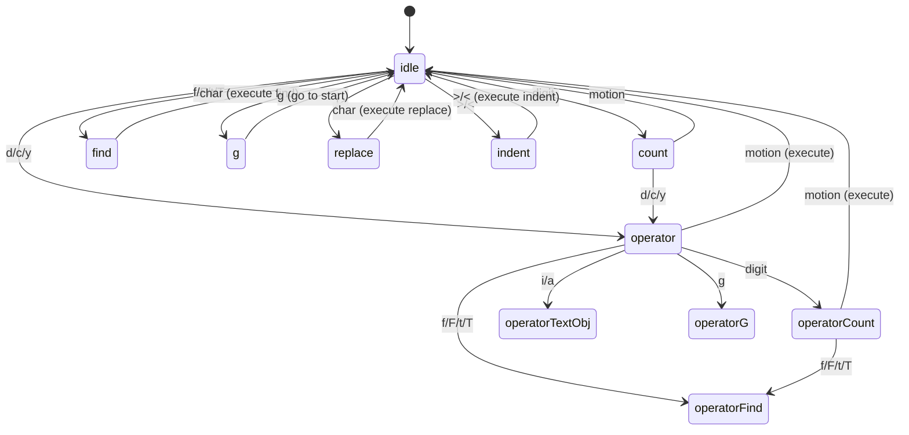

# Vim Engine

## Overview

Claude Code includes a complete Vim editing engine for terminal text input, with a two-layer finite state machine supporting INSERT/NORMAL modes, text objects, operators, motions, dot-repeat, and yank registers.

## File Inventory

| File Path | Lines | Responsibility |
|-----------|-------|---------------|
| `src/vim/types.ts` | 199 | State machine type definitions |
| `src/vim/transitions.ts` | 490 | State transition table |
| `src/vim/operators.ts` | 556 | delete/change/yank + text objects |
| `src/vim/motions.ts` | 82 | Motion command parsing |
| `src/vim/textObjects.ts` | 186 | word/WORD/quote/bracket objects |
| `src/components/VimTextInput.tsx` | 200 | Vim mode text input component |

## Two-Layer State Machine

### Outer Layer: VimState

Distinguishes INSERT and NORMAL modes.

### Inner Layer: CommandState (11 states)

```
idle → count → operator → operatorCount → operatorFind →
operatorTextObj → find → g → operatorG → replace → indent
```



## Supported Operations

### Operators
- `d` — delete
- `c` — change (delete + enter INSERT)
- `y` — yank (copy)

### Motions
- `h/l` — left/right
- `w/W` — word/WORD forward
- `b/B` — word/WORD backward
- `e/E` — end of word/WORD
- `0/$` — start/end of line
- `^` — first non-blank
- `f/F/t/T` — find character

### Text Objects
- `iw/aw` — inner/around word
- `iW/aW` — inner/around WORD
- `i"/a"` — inner/around double quote
- `i'/a'` — inner/around single quote
- `i(/a(` — inner/around parentheses
- `i[/a[` — inner/around brackets
- `i{/a{` — inner/around braces

### Special
- `.` — dot-repeat (stored as `RecordedChange`)
- `;/,` — repeat/reverse find
- `u` — undo
- Count prefix (e.g., `3dw` = delete 3 words)

## Safety

`MAX_VIM_COUNT` clamped to 10,000 to prevent accidental massive operations (e.g., `99999dd`).

## Integration

`VimTextInput.tsx` wraps the state machine into a React/Ink component:
- Mode indicator in UI (INSERT/NORMAL)
- Cursor style changes between modes
- Keyboard events dispatched through transition table
- Yank register accessible across the session
