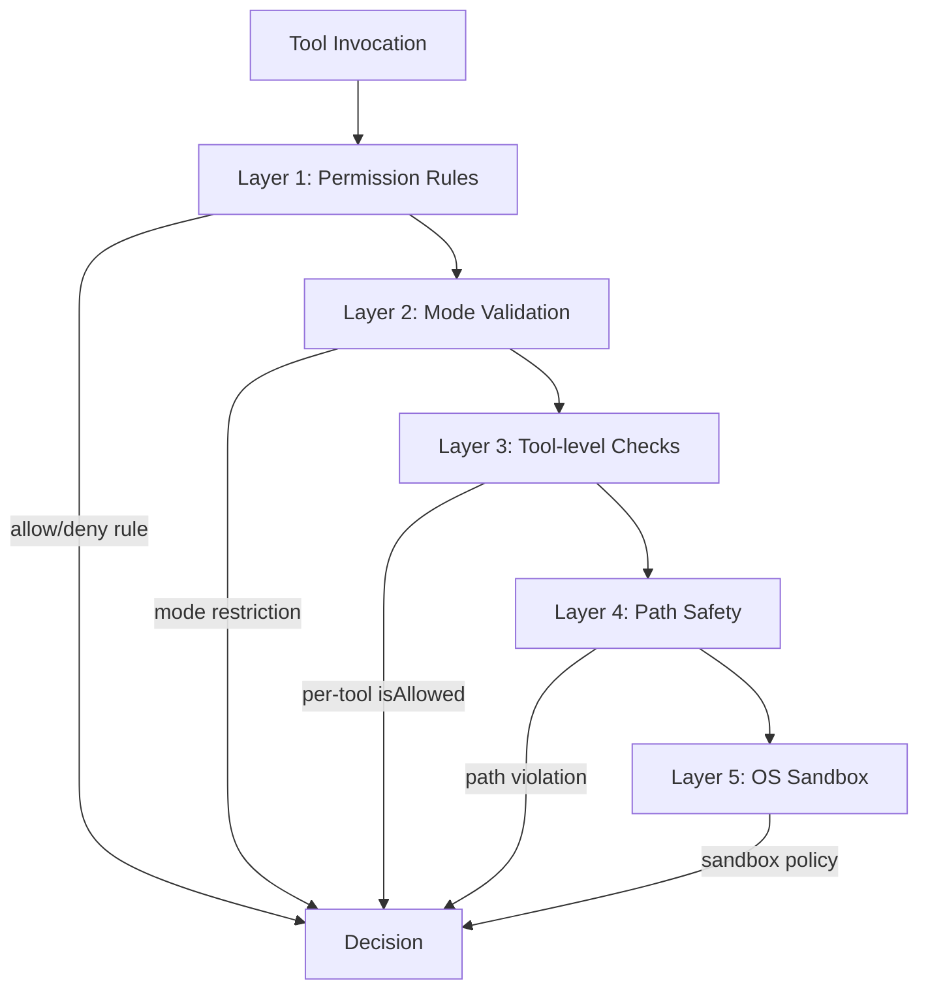

# Permission System — 5-Layer Architecture

## Overview

Every tool invocation in Claude Code is permission-gated through a 5-layer security architecture. Layers are evaluated in order; the first definitive decision (allow/deny) wins.

## The Five Layers



### Layer 1: Permission Rules

Rules from settings (user, project, local, managed, policy):

```json
{
  "permissions": {
    "allow": ["Bash(npm test)", "FileRead"],
    "deny": ["Bash(rm -rf *)"],
    "ask": ["Bash"]
  }
}
```

Pattern matching: `ToolName(ruleContent)` where ruleContent is matched against tool input.

### Layer 2: Mode Validation

| Mode | Behavior |
|------|----------|
| `default` | Prompt user for unmatched tools |
| `plan` | Only read-only tools allowed |
| `auto` | YOLO classifier decides |
| `bypassPermissions` | YOLO classifier with elevated trust |
| `acceptEdits` | File edits auto-allowed in CWD |

### Layer 3: Tool-level Checks

Each tool can define `isAllowed(input, context)`:
- BashTool: runs through `bashSecurity.ts` (2,592 lines)
- FileWriteTool: CWD containment check
- AgentTool: sub-agent permission inheritance

### Layer 4: Path Safety

File operations checked against CWD containment:
- Operations inside project directory: allowed (if other layers pass)
- Operations outside: require explicit permission or classifier approval
- Symlink resolution prevents escape via symbolic links

### Layer 5: OS Sandbox

Platform-specific sandboxing:
- **macOS**: Seatbelt profiles restricting file and network access
- **Linux**: Namespace-based isolation

## Permission Sources

Rules come from multiple sources with precedence:

```
policySettings (highest — enterprise MDM)
  → user settings (~/.claude/settings.json)
    → project settings (.claude/settings.json)
      → local settings (.claude/settings.local.json)
        → CLI args (--permission-mode)
          → session (runtime grants)
```

## Hook Integration

- `PreToolUse` hooks can return `permissionDecision: allow|deny|ask`
- `PermissionRequest` hooks can provide `updatedInput` (modify tool input) and `updatedPermissions` (write new rules)
- See [Hook System](../deep-dives/hook-system.md) for details

## Permission Decision Flow

See the [Permission Flow Diagram](../diagrams/permission-flow.mmd) for the complete decision tree including YOLO classifier integration.
